## Introdução
Neste documento busca-se construir a matriz de pós-rastreabilidade através da ótica Foward-From. Foram feitas duas tabelas, a primeira para requisitos funcionais e a segunda para os não funcionais.

## Metodologia
Primeiramente os requisitos previamente elicitados foram padronizados no arquivo de [elicitações](../RequisitosElicitados). A partir disso, buscamos no [backlog](../Backlog) e em [historias de usuário](../HistoriasDoUsuario) o épico, feature e user story relacionada a cada um dos requisitos.

Como o Duolingo não é um software com código aberto não foi possível relacionar o código fonte com cada requisito, apenas a funcionalidade já implementada.

Também foi foram defidos os seguintes critérios para avaliar os requisitos:

* Requisito **totalmente** implementado: Atende a todos os critérios de aceitação;

* Requisito **parcialmente** implementado: Atende a pelo menos um critério de aceitação;

* Requisito **não** implementado: Não atende a nenhum critério de aceitação;

## Autores

| Membros Participantes |
| --------------------- |
| Luis Gustavo          |
| Vitor Meireles        |

## Requisitos Funcionais

**Legenda**

| ID | Descrição |
| -- | --------- |
| RF | Requisito Funcional |
| RNF | Requisito Não-Funcional |
| US | Histório de Usuário |
| EP | Épico |
| FE | Feature |

**RF01**

| RF01                   | O aplicativo deve permitir o usuário praticar antes de se cadastrar |
|----------------------- | --------- |
| Épico                  | -- |
| Feature                | -- |
| US                     | -- |
| Critérios de Aceitação | -- |
| Observação             | -- |
| Funcionalidade         |  |

**RF02**

| RF02                   | O aplicativo permite que o usuário escolha o(s) idioma(s) que ele deseja aprender |
|----------------------- | --------- |
| Épico                  | [EP03](../modelage/agil/Backlog) |
| Feature                | [FE08](../modelagem/agil/Backlog) |
| US                     | [US28](../modelagem/agil/HistoriasDoUsuario) |
| Critérios de Aceitação | [US28](../modelagem/agil/HistoriasDoUsuario) |
| Observação             | Requisito **totalmente** implementado |
| Funcionalidade         |  |

**RF03**

| RF03                   | O aplicativo deve ter metas diárias para engajamento do usuário |
|----------------------- | --------- |
| Épico                  | [EP04](../modelage/agil/Backlog) |
| Feature                | [FE14](../modelagem/agil/Backlog) |
| US                     | [US40](../modelagem/agil/HistoriasDoUsuario) |
| Critérios de Aceitação | [US40](../modelagem/agil/HistoriasDoUsuario) |
| Observação             | Requisito **totalmente** implementado |
| Funcionalidade         | 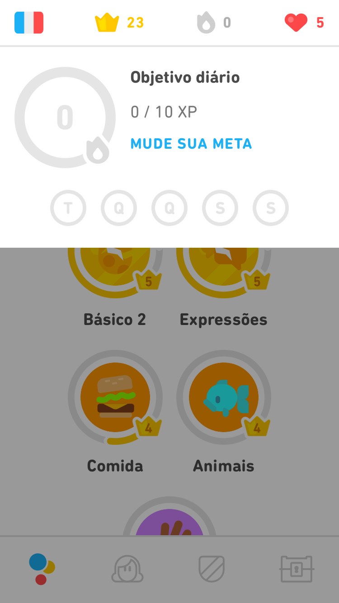 |

**RF04**

| RF04                   | O usuário deve poder escolher o nível de conhecimento que têm no idioma |
|----------------------- | --------- |
| Épico                  | [EP01](../modelagem/agil/Backlog) |
| Feature                | [F01](../modelagem/agil/Backlog) |
| US                     | [US01](../modelagem/agil/HistoriasDoUsuario) |
| Critérios de Aceitação | [US01](../modelagem/agil/HistoriasDoUsuario) |
| Observação             | Requisito **totalmente** implementado |
| Funcionalidade         |  |

**RF05**

| RF05                   | O aplicativo deve desbloquear as lições que estão abaixo no nível de conhecimento prévio do usuário |
|----------------------- | --------- |
| Épico                  | -- |
| Feature                | -- |
| US                     | -- |
| Critérios de Aceitação | -- |
| Observação             | -- |
| Funcionalidade         |  |

**RF06**

| RF06                   | O aplicativo deve exibir feedback durante as lições |
|----------------------- | --------- |
| Épico                  | -- |
| Feature                | -- |
| US                     | -- |
| Critérios de Aceitação | -- |
| Observação             | -- |
| Funcionalidade         |  |

**RF07**

| RF07                   | O aplicativo exibir as conquistas ao finalizar das atividades |
|----------------------- | --------- |
| Épico                  | [EP04](../modelagem/agil/Backlog) |
| Feature                | [FE12](../modelagem/agil/Backlog) |
| US                     | [US38](../modelagem/agil/HistoriasDoUsuario) |
| Critérios de Aceitação | [US01](../modelagem/agil/HistoriasDoUsuario) |
| Observação             | Requisito **totalmente** implementado |
| Funcionalidade         | 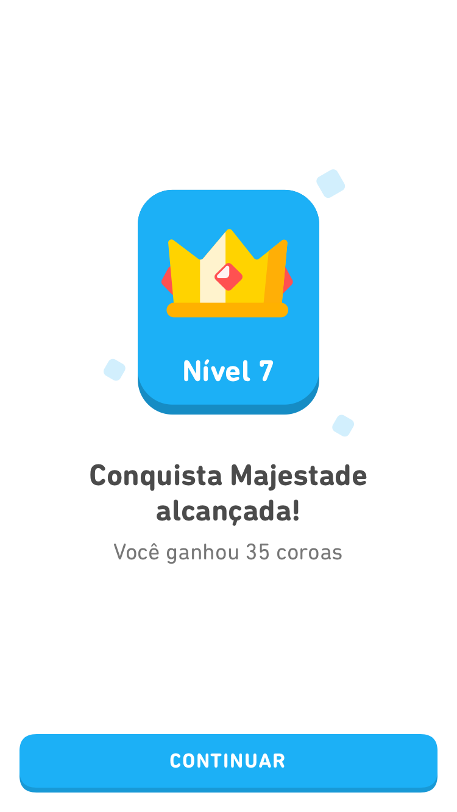 |

**RF08**

| RF08                   | Deve existir anúncio após as lições |
|----------------------- | --------- |
| Épico                  | [EP05](../modelagem/agil/Backlog) |
| Feature                | [FE19](../modelagem/agil/Backlog) |
| US                     | [US53](../modelagem/agil/HistoriasDoUsuario) |
| Critérios de Aceitação | [US53](../modelagem/agil/HistoriasDoUsuario) |
| Observação             | Requisito **totalmente** implementado |
| Funcionalidade         | 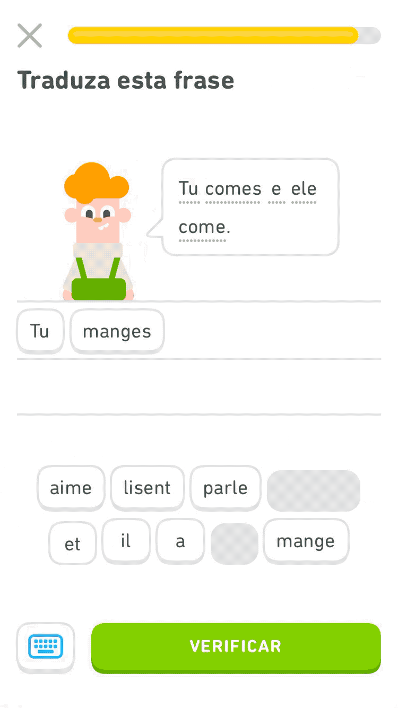 |

**RF09**

| RF09                   | O usuário deve poder criar sua conta na plataforma |
|----------------------- | --------- |
| Épico                  | [EP01](../modelagem/agil/Backlog) |
| Feature                | [FE01](../modelagem/agil/Backlog) |
| US                     | [US02](../modelagem/agil/HistoriasDoUsuario) & [US03](../modelagem/agil/HistoriasDoUsuario) |
| Critérios de Aceitação | [US02](../modelagem/agil/HistoriasDoUsuario) & [US03](../modelagem/agil/HistoriasDoUsuario) |
| Observação             | Requisito **totalmente** implementado |
| Funcionalidade         |  |

**RF10**

| RF10                   | O aplicativo deve me permitir entrar com minha conta |
|----------------------- | --------- |
| Épico                  | [EP01](../modelagem/agil/Backlog) |
| Feature                | [FE02](../modelagem/agil/Backlog) |
| US                     | [US04](../modelagem/agil/HistoriasDoUsuario) & [US05](../modelagem/agil/HistoriasDoUsuario) |
| Critérios de Aceitação | [US04](../modelagem/agil/HistoriasDoUsuario) & [US05](../modelagem/agil/HistoriasDoUsuario) |
| Observação             | Requisito **totalmente** implementado |
| Funcionalidade         |  |

**RF11**

| RF11                   | O aplicativo deve me permitir sair da minha conta |
|----------------------- | --------- |
| Épico                  | [EP01](../modelagem/agil/Backlog) |
| Feature                | [FE03](../modelagem/agil/Backlog) |
| US                     | [US06](../modelagem/agil/HistoriasDoUsuario) |
| Critérios de Aceitação | [US06](../modelagem/agil/HistoriasDoUsuario) |
| Observação             | Requisito **totalmente** implementado |
| Funcionalidade         | 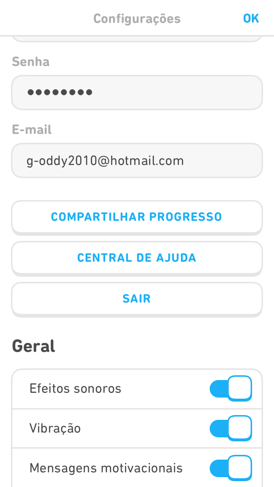 |

**RF12**

| RF12                   | Deve existir uma assinatura premium |
|----------------------- | --------- |
| Épico                  | [EP05](../modelagem/agil/Backlog) |
| Feature                | [FE18](../modelagem/agil/Backlog) |
| US                     | [US51](../modelagem/agil/HistoriasDoUsuario) & [US52](../modelagem/agil/HistoriasDoUsuario) |
| Critérios de Aceitação | [US51](../modelagem/agil/HistoriasDoUsuario) & [US52](../modelagem/agil/HistoriasDoUsuario) |
| Observação             | Requisito **totalmente** implementado |
| Funcionalidade         |  |

**RF13**

| RF13                   | Caso o usuário tenha assinatura premium ele não deve ver anúncios |
|----------------------- | --------- |
| Épico                  | -- |
| Feature                | -- |
| US                     | -- |
| Critérios de Aceitação | -- |
| Observação             | -- |
| Funcionalidade         | -- |

**RF14**

| RF14                   | O usuário deve poder editar seu perfil na plataforma |
|----------------------- | --------- |
| Épico                  | [EP02](../modelagem/agil/Backlog) |
| Feature                | [FE04](../modelagem/agil/Backlog) |
| US                     | [US07](../modelagem/agil/HistoriasDoUsuario) & [US08](../modelagem/agil/HistoriasDoUsuario) & [US09](../modelagem/agil/HistoriasDoUsuario) & [US10](../modelagem/agil/HistoriasDoUsuario) |
| Critérios de Aceitação | [US07](../modelagem/agil/HistoriasDoUsuario) & [US08](../modelagem/agil/HistoriasDoUsuario) & [US09](../modelagem/agil/HistoriasDoUsuario) & [US10](../modelagem/agil/HistoriasDoUsuario) |
| Observação             | Requisito **totalmente** implementado |
| Funcionalidade         |  |

**RF15**

| RF15                   | O aplicativo deve permitir que o usuário faça login com email/facebook ou conta do google |
|----------------------- | --------- |
| Épico                  | [EP01](../modelagem/agil/Backlog) |
| Feature                | [FE02](../modelagem/agil/Backlog) |
| US                     | [US04](../modelagem/agil/HistoriasDoUsuario) & [US05](../modelagem/agil/HistoriasDoUsuario) |
| Critérios de Aceitação | [US04](../modelagem/agil/HistoriasDoUsuario) & [US05](../modelagem/agil/HistoriasDoUsuario) |
| Observação             | Requisito **totalmente** implementado |
| Funcionalidade         |  |

**RF16**

| RF16                   | O aplicativo deve permitir que o usuário veja o seu progresso |
|----------------------- | --------- |
| Épico                  | -- |
| Feature                | -- |
| US                     | -- |
| Critérios de Aceitação | -- |
| Observação             | -- |
| Funcionalidade         | -- |

**RF17**

| RF17                   | O aplicativo permite que o usuário adicione e siga amigos |
|----------------------- | --------- |
| Épico                  | [EP04](../modelagem/agil/Backlog) |
| Feature                | [FE13](../modelagem/agil/Backlog) |
| US                     | [US39](../modelagem/agil/HistoriasDoUsuario) |
| Critérios de Aceitação | [US04](../modelagem/agil/HistoriasDoUsuario) |
| Observação             | Requisito **totalmente** implementado |
| Funcionalidade         |  |

**RF18**

| RF18                   | O aplicativo deve permitir o usuário a fazer questões de escuta, leitura, escrita e fala |
|----------------------- | --------- |
| Épico                  | [EP03](../modelagem/agil/Backlog) |
| Feature                | [FE09](../modelagem/agil/Backlog) |
| US                     | [US30](../modelagem/agil/HistoriasDoUsuario) & [US31](../modelagem/agil/HistoriasDoUsuario) & [US32](../modelagem/agil/HistoriasDoUsuario) |
| Critérios de Aceitação | [US30](../modelagem/agil/HistoriasDoUsuario) & [US31](../modelagem/agil/HistoriasDoUsuario) & [US32](../modelagem/agil/HistoriasDoUsuario) |
| Observação             | Requisito **totalmente** implementado |
| Funcionalidade         | 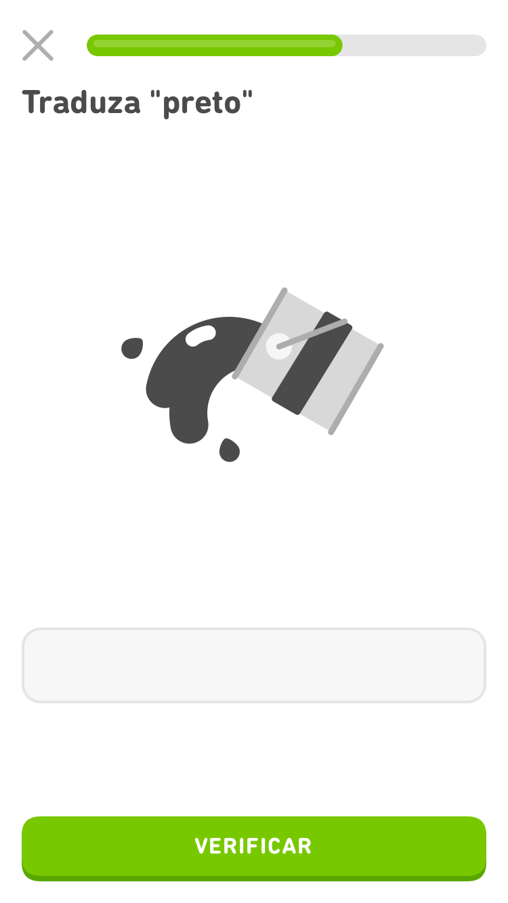      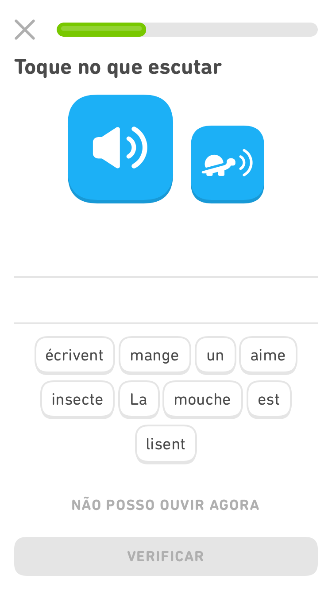   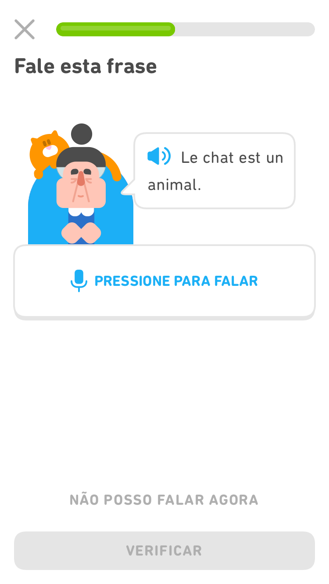 |

**RF19**

| RF19                   | O sistema é divido em níveis e com uma progressão ideal para cada módulo |
|----------------------- | --------- |
| Épico                  | [EP04](../modelagem/agil/Backlog) |
| Feature                | [FE15](../modelagem/agil/Backlog) |
| US                     | [US41](../modelagem/agil/HistoriasDoUsuario) & [US42](../modelagem/agil/HistoriasDoUsuario) |
| Critérios de Aceitação | [US41](../modelagem/agil/HistoriasDoUsuario) & [US42](../modelagem/agil/HistoriasDoUsuario) |
| Observação             | Requisito **totalmente** implementado |
| Funcionalidade         | 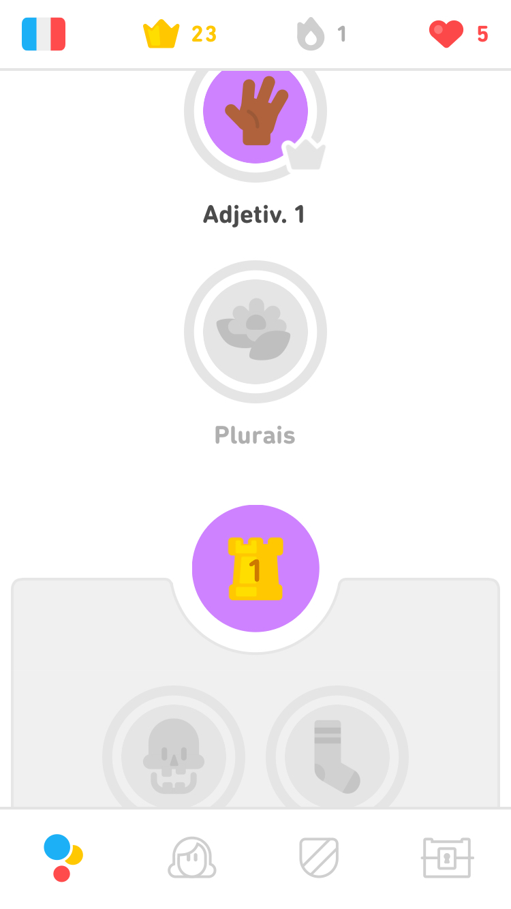 |

**RF20**

| RF20                   | Cada aula deve ter exercícios para serem realizados |
|----------------------- | --------- |
| Épico                  | -- |
| Feature                | -- |
| US                     | -- |
| Critérios de Aceitação | -- |
| Observação             | -- |
| Funcionalidade         |  |

**RF21**

| RF21                   | O aplicativo deve apresentar as aulas/exercícios de forma progressiva |
|----------------------- | --------- |
| Épico                  | [EP03](../modelagem/agil/Backlog) |
| Feature                | [FE09](../modelagem/agil/Backlog) |
| US                     | [US33](../modelagem/agil/HistoriasDoUsuario) |
| Critérios de Aceitação | [US33](../modelagem/agil/HistoriasDoUsuario) |
| Observação             | Requisito **totalmente** implementado |
| Funcionalidade         | -- |

**RF22**

| RF22                   | O aplicativo deve ter uma pontuação que reflita o número de aulas/exercícios feitos |
|----------------------- | --------- |
| Épico                  | -- |
| Feature                | -- |
| US                     | -- |
| Critérios de Aceitação | -- |
| Observação             | -- |
| Funcionalidade         |  |

**RF23**

| RF23                   | O aplicativo deve ter ligas/grupos, que sejam progressivas, que separem os usuários de acordo com seu desempenho |
|----------------------- | --------- |
| Épico                  | -- |
| Feature                | -- |
| US                     | -- |
| Critérios de Aceitação | -- |
| Observação             | -- |
| Funcionalidade         |  |

**RF24**

| RF24                   | O aplicativo deve ter um ranking dos usuários que estão em uma mesma divisão |
|----------------------- | --------- |
| Épico                  | -- |
| Feature                | -- |
| US                     | -- |
| Critérios de Aceitação | -- |
| Observação             | -- |
| Funcionalidade         | 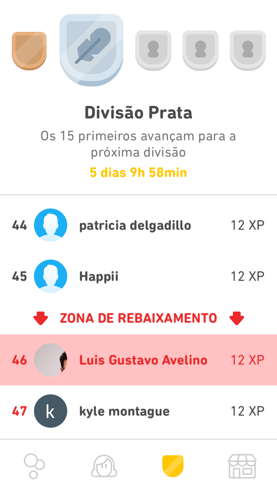 |

**RF25**

| RF25                   | O aplicativo deve contabilizar o número de dias seguidos que usuário cumpre sua meta diária |
|----------------------- | --------- |
| Épico                  | -- |
| Feature                | -- |
| US                     | -- |
| Critérios de Aceitação | -- |
| Observação             | -- |
| Funcionalidade         | 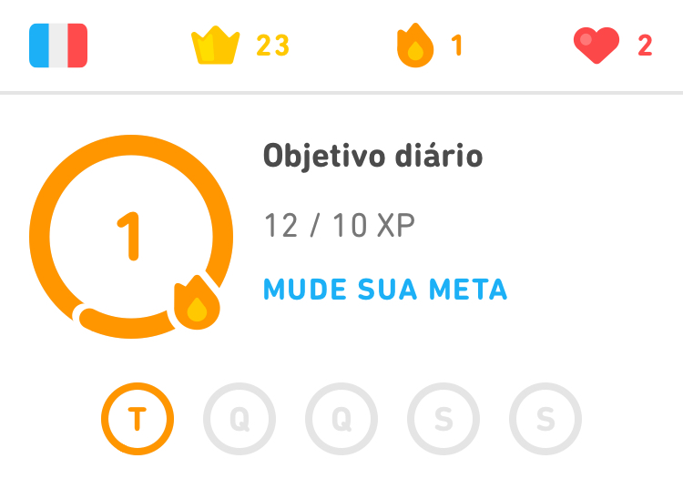 |

**RF26**

| RF26                   | O aplicativo deve notificar o usuário sobre as metas diárias |
|----------------------- | --------- |
| Épico                  | -- |
| Feature                | -- |
| US                     | -- |
| Critérios de Aceitação | -- |
| Observação             | -- |
| Funcionalidade         | -- |

**RF27**

| RF27                   | O aplicativo deve possuir uma moeda, que sirva de recompensa para os exercícios realizados |
|----------------------- | --------- |
| Épico                  | -- |
| Feature                | -- |
| US                     | -- |
| Critérios de Aceitação | -- |
| Observação             | -- |
| Funcionalidade         | 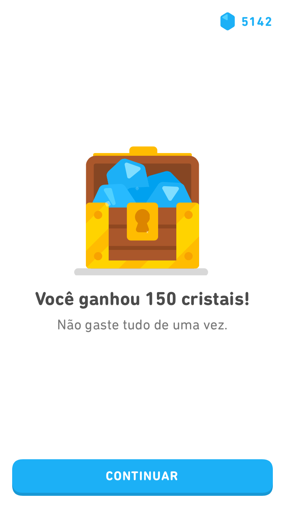 |

**RF28**

| RF28                   | O aplicativo deve possuir uma loja aonde ele poderá gastar suas moedas adquiridas |
|----------------------- | --------- |
| Épico                  | -- |
| Feature                | -- |
| US                     | -- |
| Critérios de Aceitação | -- |
| Observação             | -- |
| Funcionalidade         | 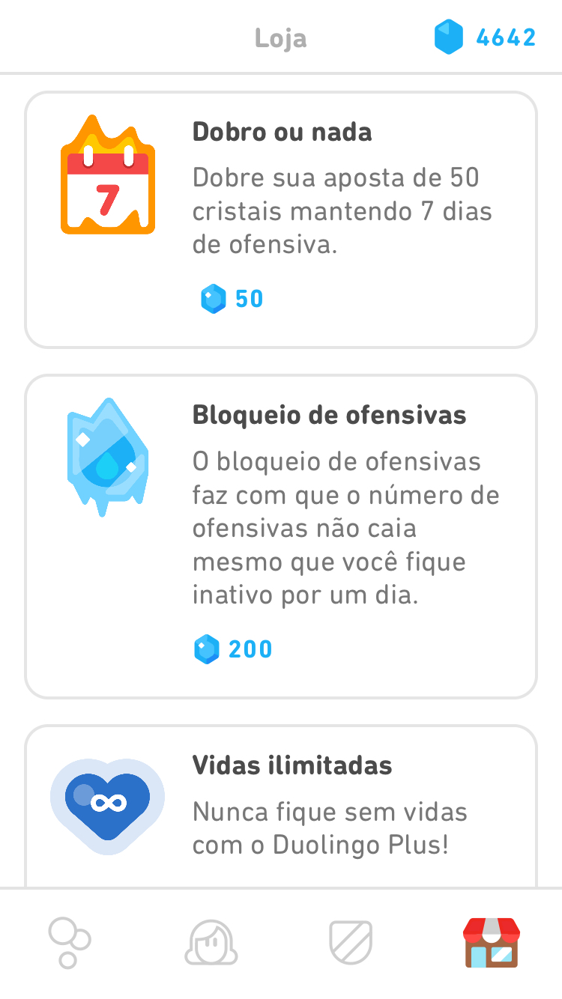 |

**RF29**

| RF29                   | O aplicativo deve repetir exercícios, de forma que ajude o usuário a aprender/relembrar |
|----------------------- | --------- |
| Épico                  | -- |
| Feature                | -- |
| US                     | -- |
| Critérios de Aceitação | -- |
| Observação             | -- |
| Funcionalidade         | -- |

**RF30**

| RF30                   | Se o usuário ficar algum tempo sem utilizar o aplicativo, o aplicativo deve fazer com que ele volte ao início do curso |
|----------------------- | --------- |
| Épico                  | -- |
| Feature                | -- |
| US                     | -- |
| Critérios de Aceitação | -- |
| Observação             | -- |
| Funcionalidade         | -- |

**RF31**

| RF31                   | Deve aparecer uma mensagem dando Boas Vindas |
|----------------------- | --------- |
| Épico                  | -- |
| Feature                | -- |
| US                     | -- |
| Critérios de Aceitação | -- |
| Observação             | -- |
| Funcionalidade         |  |

**RF32**

| RF32                   | Devo ser apresentado com a opção de Registro ou Login |
|----------------------- | --------- |
| Épico                  | -- |
| Feature                | -- |
| US                     | -- |
| Critérios de Aceitação | -- |
| Observação             | -- |
| Funcionalidade         | 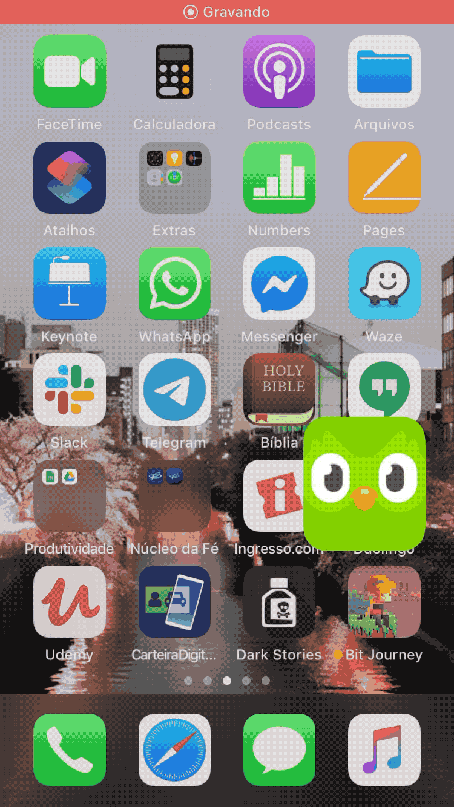 |

**RF33**

| RF33                   | Deve haver mais de uma opção de idioma disponível para aprender |
|----------------------- | --------- |
| Épico                  | -- |
| Feature                | -- |
| US                     | -- |
| Critérios de Aceitação | -- |
| Observação             | -- |
| Funcionalidade         |  |

**RF34**

| RF34                   | Deve apresentar uma opção para ver mais idiomas disponíveis |
|----------------------- | --------- |
| Épico                  | -- |
| Feature                | -- |
| US                     | -- |
| Critérios de Aceitação | -- |
| Observação             | -- |
| Funcionalidade         |  |

**RF35**

| RF35                   | Deve existir um teste de nivelamento |
|----------------------- | --------- |
| Épico                  | -- |
| Feature                | -- |
| US                     | -- |
| Critérios de Aceitação | -- |
| Observação             | -- |
| Funcionalidade         |  |

**RF36**

| RF36                   | O aplicativo deve aumentar a pontuação do usuário a cada aula finalizada |
|----------------------- | --------- |
| Épico                  | -- |
| Feature                | -- |
| US                     | -- |
| Critérios de Aceitação | -- |
| Observação             | -- |
| Funcionalidade         | 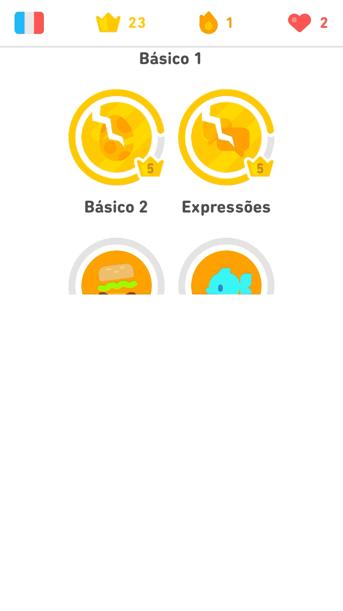 |

**RF37**

| RF37                   | O usuário deve receber incentivos e dicas durante os exercícios |
|----------------------- | --------- |
| Épico                  | -- |
| Feature                | -- |
| US                     | -- |
| Critérios de Aceitação | -- |
| Observação             | -- |
| Funcionalidade         |  |

**RF38**

| RF38                   | O aplicativo deve mostrar os Termos e Política de Privacidade |
|----------------------- | --------- |
| Épico                  | -- |
| Feature                | -- |
| US                     | -- |
| Critérios de Aceitação | -- |
| Observação             | -- |
| Funcionalidade         |        |

**RF39**

| RF39                   | O usuário deve poder testar a versão premium gratuitamente |
|----------------------- | --------- |
| Épico                  | -- |
| Feature                | -- |
| US                     | -- |
| Critérios de Aceitação | -- |
| Observação             | -- |
| Funcionalidade         |  |

**RF40**

| RF40                   | O usuário deve poder escolher um novo idioma a qualquer momento |
|----------------------- | --------- |
| Épico                  | -- |
| Feature                | -- |
| US                     | -- |
| Critérios de Aceitação | -- |
| Observação             | -- |
| Funcionalidade         |  |

**RF41**

| RF41                   | O usuário deve poder ajustar quanto tempo por dia ele quer gastar fazendo lições |
|----------------------- | --------- |
| Épico                  | -- |
| Feature                | -- |
| US                     | -- |
| Critérios de Aceitação | -- |
| Observação             | -- |
| Funcionalidade         |  |

**RF42**

| RF42                   | O usuário deve poder ajustar as configurações dos exercícios |
|----------------------- | --------- |
| Épico                  | -- |
| Feature                | -- |
| US                     | -- |
| Critérios de Aceitação | -- |
| Observação             | -- |
| Funcionalidade         | 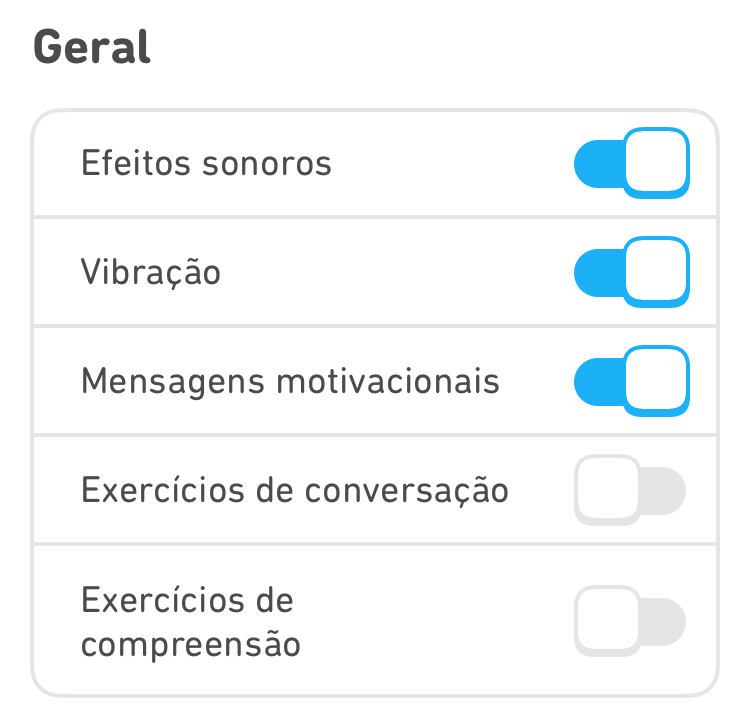 |

**RF43**

| RF43                   | O usuário deve poder compartilhar seu progresso |
|----------------------- | --------- |
| Épico                  | -- |
| Feature                | -- |
| US                     | -- |
| Critérios de Aceitação | -- |
| Observação             | -- |
| Funcionalidade         |  |

## Requisitos Não-Funcionais

**RNF01**

| RNF01                   | O aplicativo deve engajar o usuário |
|----------------------- | --------- |
| Épico                  | -- |
| Feature                | -- |
| US                     | -- |
| Critérios de Aceitação | -- |
| Observação             | -- |
| Funcionalidade         |  |

**RNF02**

| RNF02                   | O aplicativo deve ser fácil de usar |
|----------------------- | --------- |
| Épico                  | -- |
| Feature                | -- |
| US                     | -- |
| Critérios de Aceitação | -- |
| Observação             | -- |
| Funcionalidade         |  |

**RNF03**

| RNF03                   | O aplicativo deve interativo |
|----------------------- | --------- |
| Épico                  | -- |
| Feature                | -- |
| US                     | -- |
| Critérios de Aceitação | -- |
| Observação             | -- |
| Funcionalidade         |  |

**RNF04**

| RNF04                   | O aplicativo deve ser monetizado |
|----------------------- | --------- |
| Épico                  | -- |
| Feature                | -- |
| US                     | -- |
| Critérios de Aceitação | -- |
| Observação             | -- |
| Funcionalidade         | 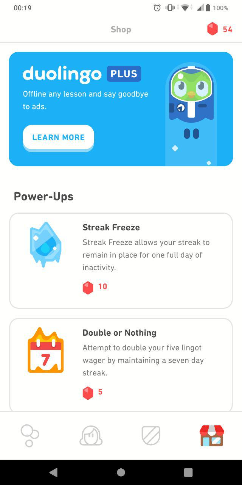 |

**RNF05**

| RNF05                   | O aplicativo deve ser gameficado |
|----------------------- | --------- |
| Épico                  | -- |
| Feature                | -- |
| US                     | -- |
| Critérios de Aceitação | -- |
| Observação             | -- |
| Funcionalidade         |  |

**RNF06**

| RNF06                   | O usuário deve ser recompensado por seu progresso |
|----------------------- | --------- |
| Épico                  | -- |
| Feature                | -- |
| US                     | -- |
| Critérios de Aceitação | -- |
| Observação             | -- |
| Funcionalidade         |  |

**RNF07**

| RNF07                   | O software deve ser multiplataforma |
|----------------------- | --------- |
| Épico                  | -- |
| Feature                | -- |
| US                     | -- |
| Critérios de Aceitação | -- |
| Observação             | -- |
| Funcionalidade         |  |

**RNF08**

| RNF08                   | O aplicativo deve permitir a segurança dos dados do usuário |
|----------------------- | --------- |
| Épico                  | -- |
| Feature                | -- |
| US                     | -- |
| Critérios de Aceitação | -- |
| Observação             | -- |
| Funcionalidade         | -- |

**RNF09**

| RNF09                   | O aplicativo deve ser rápido de usar |
|----------------------- | --------- |
| Épico                  | -- |
| Feature                | -- |
| US                     | -- |
| Critérios de Aceitação | -- |
| Observação             | -- |
| Funcionalidade         | -- |

**RNF10**

| RNF10                   | O aplicativo funcionar 24/7 |
|----------------------- | --------- |
| Épico                  | -- |
| Feature                | -- |
| US                     | -- |
| Critérios de Aceitação | -- |
| Observação             | -- |
| Funcionalidade         | -- |

**RNF11**

| RNF11                   | O aplicativo deve estimular a competitividade |
|----------------------- | --------- |
| Épico                  | -- |
| Feature                | -- |
| US                     | -- |
| Critérios de Aceitação | -- |
| Observação             | -- |
| Funcionalidade         |  |

**RNF12**

| RNF12                   | O aplicativo deve promover a integração dos usuários |
|----------------------- | --------- |
| Épico                  | -- |
| Feature                | -- |
| US                     | -- |
| Critérios de Aceitação | -- |
| Observação             | -- |
| Funcionalidade         |  |

## Referências

SERRANO, Maurício; SERRANO, Milene. Requisitos - Aula 26. 2º/2019. 44 slides. Material apresentado para a disciplina de Requisitos de Software no curso de Engenharia de Software da UnB, FGA.

RocketChat-Requisitos. Disponível em: https://marcosnbj.github.io/2019.1-RocketChat/P%C3%B3s-Rastreabilidade/Foward-From/ . Acesso em 12/11/2019.

GuiaBolso-Requisitos. Disponível em: https://fga-disciplinas.github.io/2019.1-Guia-Bolso/pos-rastreabilidade/forward/ . Acesso em 12/11/2019.